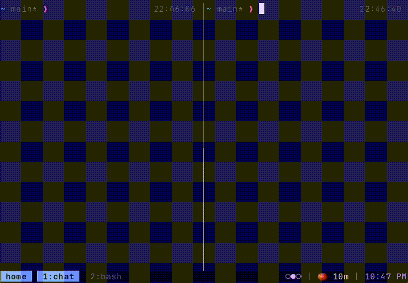
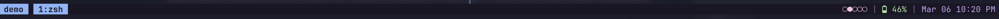
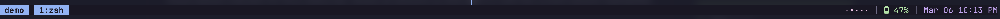
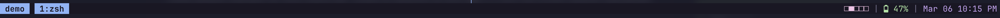
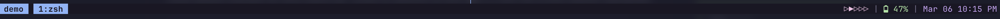
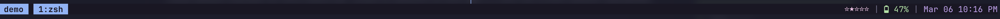
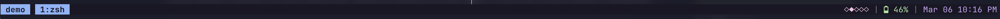
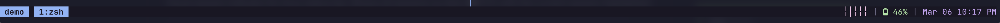

# tmux-session-dots

Visual session indicator for tmux status bar. Shows all sessions as dots (●○○) with the current session highlighted.



## Why?

If you use multiple tmux sessions and frequently switch between them (e.g., with `Alt+[` and `Alt+]`), this gives you instant visual feedback about:
- How many sessions you have
- Which session you're currently in
- Session state at a glance

## Installation

### Via TPM (recommended)

Add to your `~/.tmux.conf`:

```bash
set -g @plugin 'jtmcginty/tmux-session-dots'
```

Then add `#{session_dots}` wherever you want in your status bar:

```bash
set -g status-right "#{session_dots} | %H:%M %p"
```

Press `prefix + I` to install.

### Manual

```bash
git clone https://github.com/jtmcginty/tmux-session-dots ~/tmux-session-dots
```

Add to your `~/.tmux.conf`:

```bash
run-shell ~/tmux-session-dots/session-dots.tmux
set -g status-right "#{session_dots} | %H:%M"
```

## Usage

Simply add `#{session_dots}` anywhere in your `status-right` or `status-left`:

```bash
# At the beginning
set -g status-right "#{session_dots} | %H:%M %p"

# In the middle
set -g status-right "%H:%M | #{session_dots} | #H"

# Multiple places
set -g status-left "#{session_dots}"
set -g status-right "#{session_dots} | %H:%M"
```

The plugin handles all formatting - you just add separators and spacing as you prefer.

## Configuration

### Symbols

Default is `●` (active) and `○` (inactive). Swap them for anything you like:

```bash
set -g @session-dots-active "▶"
set -g @session-dots-inactive "–"
```

Some popular combinations:

| Active | Inactive | Preview |
|--------|----------|---------|
| `●` | `○` | `○●○○` (default) |
| `•` | `·` | `·•··` |
| `■` | `□` | `□□■□` |
| `▶` | `▷` | `▷▶▷▷` |
| `★` | `☆` | `☆★☆☆` |
| `◆` | `◇` | `◇◇◆◇` |
| `┃` | `╎` | `╎╎┃╎` |

**Screenshots:**









Want to try before you commit? Run the included preview script:

```bash
./scripts/preview.sh "▶" "–"
```

### Color

Default is Catppuccin pink (`#f5c2e7`). Customize with:

```bash
set -g @session-dots-color "#89b4fa"  # Catppuccin blue
set -g status-right "#{session_dots} | %H:%M"
```

### Separator

Default is ` | `. Customize with:

```bash
set -g @session-dots-separator "  "  # Just spaces
```

Note: Separator is only used when auto-placement is enabled (default). With manual placement, you control all formatting.

## Recommended: Quick Session Switching

This plugin pairs well with keybindings for cycling through sessions. Add these to your `~/.tmux.conf` to switch sessions with `Option + [` and `Option + ]`:

```bash
# Previous/next session with Option + brackets
bind-key -n M-[ switch-client -p
bind-key -n M-] switch-client -n
```

The dots update instantly as you switch, giving you a visual indicator of where you are.

## How it works

- Active symbol (default `●`) = Current session
- Inactive symbol (default `○`) = Other sessions
- Uses tmux hooks for instant updates on session change
- Correctly identifies current session (not just attached sessions)

## Performance

The plugin uses `client-session-changed` hooks to trigger instant status bar updates when switching sessions. This makes the indicator update immediately, similar to native tmux window highlighting.

## License

MIT

## Thanks & Support

Loving the dots?
If this plugin makes your tmux life better, please give it a ⭐ on GitHub — it helps more people discover it!

Happy session switching!
