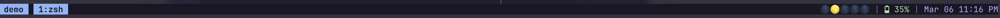

# tmux-session-dots

Visual session indicator for your tmux status bar. Shows all sessions as symbols with the current one highlighted — defaults to dots (`●○○`) and fully customizable.


## Why?

If you use multiple tmux sessions and frequently switch between them (e.g., with `Alt+[` and `Alt+]`), this gives you instant visual feedback about:
- How many sessions you have
- Which session you're currently in
- Session state at a glance

## Symbols

Choose any characters for the active and inactive states:

| Active | Inactive | Preview |
|--------|----------|---------|
| `●` | `○` | `○●○○` (default) |
| `•` | `·` | `·•··` |
| `■` | `□` | `□□■□` |
| `★` | `☆` | `☆★☆☆` |
| `◆` | `◇` | `◇◇◆◇` |
| 🌕 | 🌑 | `🌕🌑🌑🌑` `🌑🌕🌑🌑` `🌑🌑🌕🌑` `🌑🌑🌑🌕` |
| 💎 | 🪨 | `💎🪨🪨🪨` `🪨💎🪨🪨` `🪨🪨💎🪨` `🪨🪨🪨💎` |
| 🧿 | `·` | `🧿···` `·🧿··` `··🧿·` `···🧿` |
| 🌩️ | ☁️ | `🌩️☁️☁️☁️` `☁️🌩️☁️☁️` `☁️☁️🌩️☁️` `☁️☁️☁️🌩️` |
| 🔥 | 🪵 | `🔥🪵🪵🪵` `🪵🔥🪵🪵` `🪵🪵🔥🪵` `🪵🪵🪵🔥` |
| 👄 | 👁️ | `👄👁️👁️👁️` `👁️👄👁️👁️` `👁️👁️👄👁️` `👁️👁️👁️👄` |
| `(*)` | `( )` | `(*)( )( )( )` `( )(*)( )( )` `( )( )(*)( )` `( )( )( )(*)` |




Want to try a combination before committing? Use the included preview script:

```bash
./scripts/preview.sh "▶" "▷"
```

## Installation

### Via TPM (recommended)

Add to your `~/.tmux.conf`:

```bash
set -g @plugin 'jtmcginty/tmux-session-dots'
```

Then add `#{session_dots}` wherever you want in your status bar:

```bash
set -g status-right "#{session_dots} | %H:%M %p"
```

Press `prefix + I` to install.

### Manual

```bash
git clone https://github.com/jtmcginty/tmux-session-dots ~/tmux-session-dots
```

Add to your `~/.tmux.conf`:

```bash
run-shell ~/tmux-session-dots/session-dots.tmux
set -g status-right "#{session_dots} | %H:%M"
```

## Usage

Add `#{session_dots}` anywhere in your `status-right` or `status-left`:

```bash
# At the beginning of status-right
set -g status-right "#{session_dots} | %H:%M %p"

# In the middle
set -g status-right "%H:%M | #{session_dots} | #H"

# On the left side
set -g status-left "#{session_dots} "
```

The plugin handles all formatting — you just add separators and spacing as you prefer.

## Configuration

### Symbols

```bash
set -g @session-dots-active "▶"
set -g @session-dots-inactive "▷"
```

### Color

Default is Catppuccin pink (`#f5c2e7`). Customize with:

```bash
set -g @session-dots-color "#89b4fa"  # Catppuccin blue
```

### Bell indicator (optional)

Disabled by default. Highlights sessions where a bell has fired in any window — useful if you wire up shell notifications for long-running commands.

```bash
set -g @session-dots-bell-enabled "true"
set -g @session-dots-bell "◉"  # default
```

With bell enabled, three states are shown: active (`●`), bell (`◉`), inactive (`○`). Bell takes priority over inactive but never overrides the current session indicator.

**Triggering bells:** tmux `monitor-bell` is on by default. Emit a bell from any command with `echo -e "\a"`, or wire it into your shell's `precmd` hook to fire automatically when long-running commands finish.

## Recommended: Quick Session Switching

This plugin pairs well with keybindings for cycling through sessions. Add these to your `~/.tmux.conf` to switch sessions with `Option + [` and `Option + ]`:

```bash
bind-key -n M-[ switch-client -p
bind-key -n M-] switch-client -n
```

The indicator updates instantly as you switch.

## How it works

Uses tmux's `client-session-changed` hook to update the status bar the moment you switch sessions — no polling, no delay. Correctly identifies the current session rather than just the attached one.

## License

MIT

## Thanks & Support

Loving the dots?
If this plugin makes your tmux life better, please give it a ⭐ on GitHub — it helps more people discover it!

Happy session switching!
